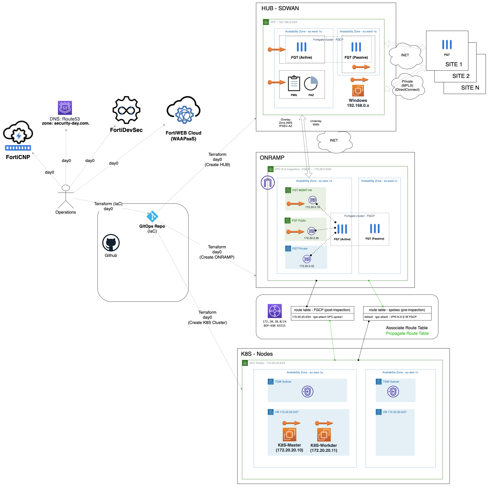
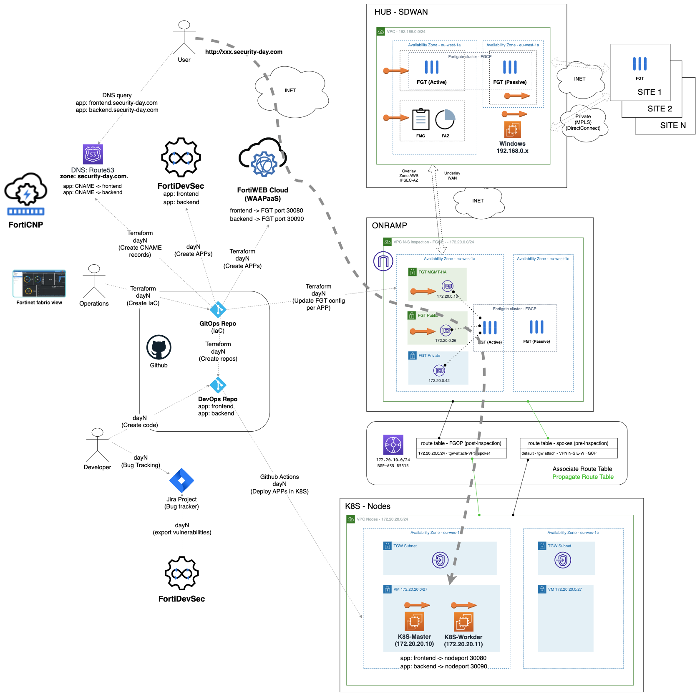

# GitOps and DevSecOps project with Fortinet
## Introduction
This project provides an illustration of how an environment can be utilized to establish a comprehensive CICD (Continuous Integration and Continuous Deployment) cycle for an application utilizing an Agile methodology and GitOps. The security aspect has been given due consideration throughout the application's life cycle, from coding to runtime with Fortinet security services solutions as FortiDevSec, FortiCNP, FortiWeb Cloud SaaS and Fortigate NGFW. 

## Overview

### [0_fgt_k8s_cluster](./0_fgt_k8s_cluster): 
  - Day 0 deployment of all necessary infrastructure in AWS: 
  - Kuberntes cluster, 
  - Fortigate cluster (HUB and SPOKE), 
  - FortiManager and FortiAnalyzer
  - VPC, AWS Route 53 ...

### [dayN_frontend_app](./dayN_frontend_app): 
  - Day N deployment to create a CICD pipeline to deploy and run an application (DVWA APP):
  - New GitHub repository with configured Actions workflow and secrets to seamlessly deploy application in deployed K8S cluster
  - First commit of code to new repo and launch first workflow to deploy APP
  - Update Fortigate firewall policy to allow new APP
  - Create new FortiWEB Cloud application
  - Create new DNS CNAME point FQDN APP to FortiWEB Cloud (frontend.securityday-demo.com)

### [dayN_backend_app](./dayN_backend_app): 
  - Day N deployment to create a CICD pipeline to deploy and run an application (Vulnerable Flask APP):
  - New GitHub repository with configured Actions workflow and secrets to seamlessly deploy application in deployed K8S cluster
  - First commit of code to new repo and launch first workflow to deploy APP
  - Update Fortigate firewall policy to allow new APP
  - Create new FortiWEB Cloud application
  - Create new DNS CNAME point FQDN APP to FortiWEB Cloud (backend.securityday-demo.com)

## Diagram solution

0 day infrastructure deployment (Ops/Sec team)


N day infrastructure deployment (DevSecOps team)


## Requirements
* [Terraform](https://learn.hashicorp.com/terraform/getting-started/install.html) >= 1.0.0
- Terraform Provider hashicorp/random v3.4.3
- Terraform Provider hashicorp/template v2.2.0
- Terraform Provider hashicorp/archive v2.2.0
- Terraform Provider hashicorp/http v3.2.1
- Terraform Provider hashicorp/aws v4.39.0
- Terraform Provider hashicorp/local v2.2.3
- Terraform Provider hashicorp/tls v4.0.4

## Deployment
* Clone the repository.
* Change ACCESS_KEY and SECRET_KEY values in terraform.tfvars.example.  And rename `terraform.tfvars.example` to `terraform.tfvars`.
* Change parameters in the variables.tf.
* IMPORTANT: update file 0_UPDATE_locals.tf
* If using SSO, uncomment the token variable in variables.tf and providers.tf
* Initialize the providers and modules:
  ```sh
  $ terraform init
  ```
* Submit the Terraform plan:
  ```sh
  $ terraform plan
  ```
* Verify output.
* Confirm and apply the plan:
  ```sh
  $ terraform apply
  ```
* If output is satisfactory, type `yes`.


## Destroy the instance
To destroy the instance, use the command:
```sh
$ terraform destroy
```

# Support
This a personal repository with goal of testing and demo Fortinet solutions on the Cloud. No support is provided and must be used by your own responsability. Cloud Providers will charge for this deployments, please take it in count before proceed.

## License
Based on Fortinet repositories with original [License](https://github.com/fortinet/fortigate-terraform-deploy/blob/master/LICENSE) © Fortinet Technologies. All rights reserved.

